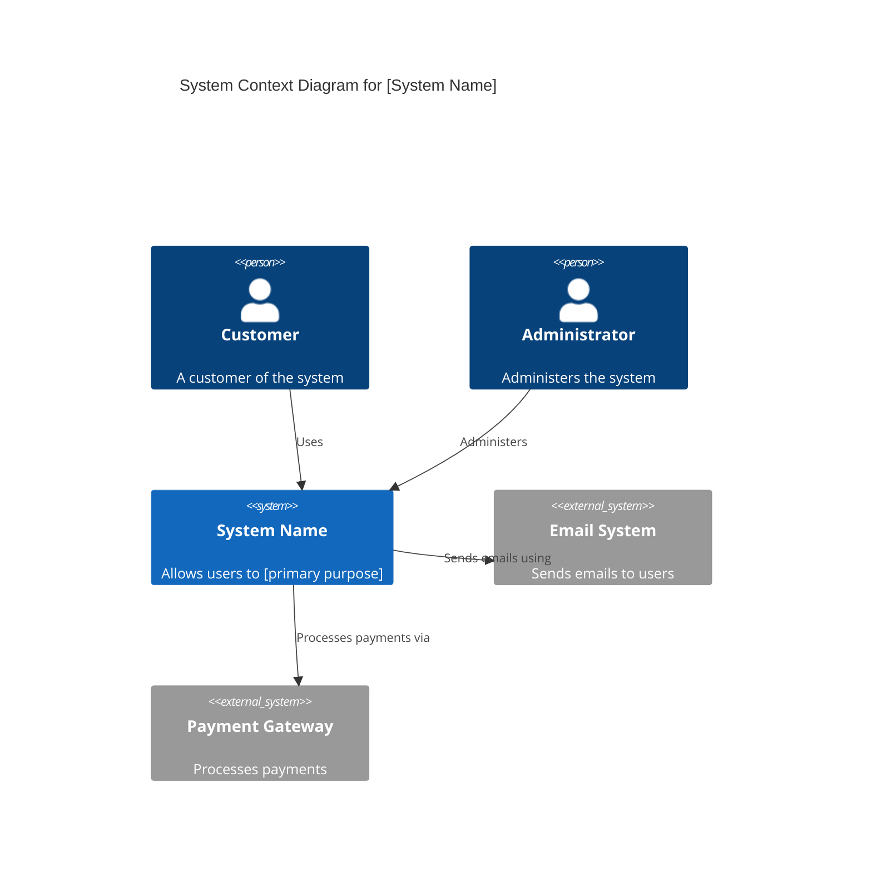

# Level 1: System Context Diagram

The System Context diagram is the highest level of abstraction and shows how your system fits into the world around it.

## Purpose

- Shows the big picture of the system
- Identifies the people (actors/personas/roles) who use it
- Identifies other software systems that it interacts with
- Focuses on relationships and responsibilities, not technology

## Key Elements

- **Your System** - The software system you're building (shown as a single box)
- **People** - Users, actors, roles that interact with the system
- **External Systems** - Other software systems your system depends on or integrates with
- **Relationships** - How these elements interact with each other

## Guidelines

1. **Keep it simple** - One diagram per software system
2. **Show the scope** - Make the system boundary clear
3. **Focus on users** - Show who uses the system and why
4. **External dependencies** - Show what external systems are involved
5. **High-level only** - Don't show implementation details or technology choices

## Example: System Context Diagram

```plantuml
@startuml
!include https://raw.githubusercontent.com/plantuml-stdlib/C4-PlantUML/master/C4_Context.puml

LAYOUT_WITH_LEGEND()

title System Context Diagram for [System Name]

Person(customer, "Customer", "A customer of the system")
Person(admin, "Administrator", "Administers the system")

System(systemName, "System Name", "Allows users to [primary purpose]")

System_Ext(emailSystem, "Email System", "Sends emails to users")
System_Ext(paymentGateway, "Payment Gateway", "Processes payments")
System_Ext(analyticsSystem, "Analytics System", "Collects and analyzes usage data")

Rel(customer, systemName, "Uses", "HTTPS")
Rel(admin, systemName, "Administers", "HTTPS")
Rel(systemName, emailSystem, "Sends emails using", "SMTP")
Rel(systemName, paymentGateway, "Processes payments via", "HTTPS/JSON")
Rel(systemName, analyticsSystem, "Sends events to", "HTTPS/JSON")

@enduml
```

## Mermaid Alternative



## Template

Use this template to create your own system context diagram:

### System: [Your System Name]

**Description:** [Brief description of what the system does]

**Primary Users:**
- [User Type 1]: [What they use the system for]
- [User Type 2]: [What they use the system for]

**External Systems:**
- [External System 1]: [How it's used and why]
- [External System 2]: [How it's used and why]

**Key Interactions:**
- [User] → [System]: [What the user does]
- [System] → [External System]: [What data/requests are exchanged]

## Tips

- Start here before diving into details
- Use this to communicate with non-technical stakeholders
- Update when significant integrations or user types are added
- Keep the diagram readable - if it's too complex, you might need multiple systems
