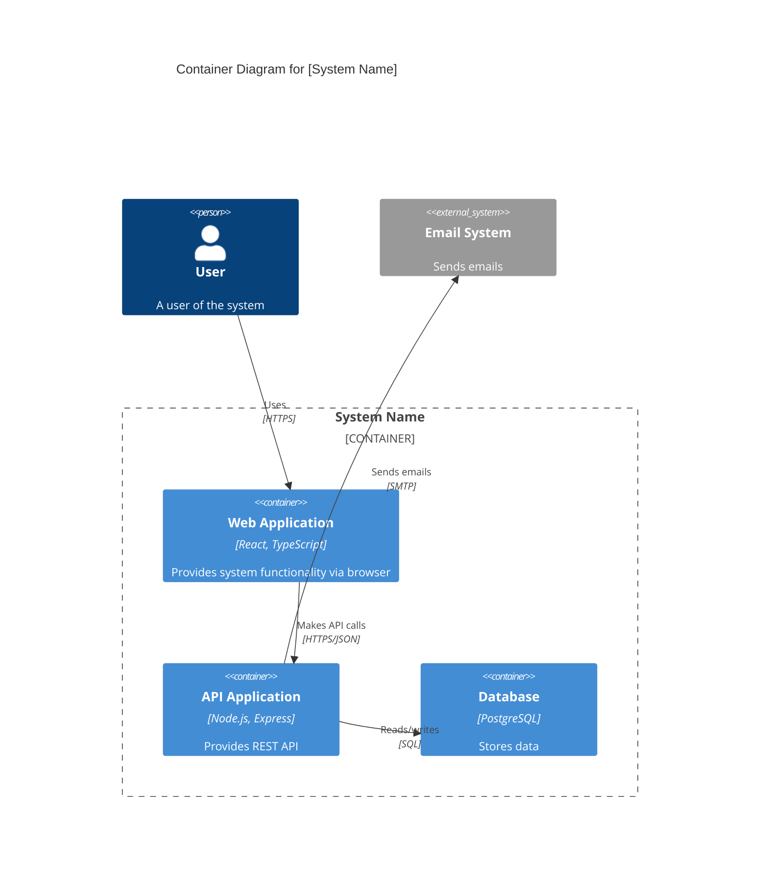

# Level 2: Container Diagram

The Container diagram zooms into the software system and shows the high-level technical building blocks (containers) and how they interact.

## Purpose

- Shows the high-level shape of the software architecture
- Shows how responsibilities are distributed across containers
- Shows major technology decisions
- Shows how containers communicate with each other

## What is a "Container"?

In the C4 model, a **container** is a separately runnable/deployable unit that executes code or stores data. Examples include:

- **Server-side web application** - Java/Spring Boot, Node.js/Express, Python/Django
- **Client-side web application** - React, Angular, Vue.js SPA
- **Mobile app** - Native iOS, Android, or cross-platform
- **Desktop application** - Electron, native desktop apps
- **Database** - Relational, NoSQL, graph databases
- **File system** - Blob storage, file shares
- **Microservice** - Individual service in a microservices architecture
- **Message broker** - RabbitMQ, Kafka, AWS SQS
- **Serverless function** - AWS Lambda, Azure Functions
- **API Gateway** - Kong, AWS API Gateway

## Key Elements

- **Containers** - Runnable/deployable units of your system
- **Technology choices** - Programming languages, frameworks, databases
- **Relationships** - Communication protocols between containers
- **External systems** - From the context diagram, now showing specific integration points

## Guidelines

1. **Focus on the big picture** - Show major containers, not every class or module
2. **Show technology** - Include key technology choices (language, framework, database type)
3. **Communication protocols** - Show how containers communicate (HTTP/REST, messaging, etc.)
4. **Deployment units** - Each container should be separately deployable
5. **One diagram** - Typically one diagram per software system, unless very complex

## Example: Container Diagram

```plantuml
@startuml
!include https://raw.githubusercontent.com/plantuml-stdlib/C4-PlantUML/master/C4_Container.puml

LAYOUT_WITH_LEGEND()

title Container Diagram for [System Name]

Person(user, "User", "A user of the system")

System_Boundary(c1, "System Name") {
    Container(webApp, "Web Application", "React, TypeScript", "Provides system functionality via browser")
    Container(api, "API Application", "Node.js, Express", "Provides system functionality via REST API")
    Container(database, "Database", "PostgreSQL", "Stores user data, transactions, etc.")
    Container(cache, "Cache", "Redis", "Stores session data and cached responses")
    Container(fileStorage, "File Storage", "AWS S3", "Stores uploaded files and assets")
}

System_Ext(emailSystem, "Email System", "Sends emails to users")

Rel(user, webApp, "Uses", "HTTPS")
Rel(webApp, api, "Makes API calls to", "HTTPS/JSON")
Rel(api, database, "Reads from and writes to", "TCP/PostgreSQL Protocol")
Rel(api, cache, "Reads from and writes to", "TCP/Redis Protocol")
Rel(api, fileStorage, "Stores and retrieves files", "HTTPS/S3 API")
Rel(api, emailSystem, "Sends emails using", "SMTP")

@enduml
```

## Mermaid Alternative



## Template

Use this template to document your containers:

### Container: [Container Name]

**Type:** [Web App | API | Database | Mobile App | Service | etc.]  
**Technology:** [Primary language/framework/platform]  
**Responsibilities:**
- [Responsibility 1]
- [Responsibility 2]

**Interfaces:**
- [API endpoints, message formats, etc.]

**Data:**
- [What data does it store or process]

**Dependencies:**
- [Other containers or external systems it depends on]

## Tips

- Start with the major architectural components
- Don't create containers for libraries or frameworks
- Each container should be independently deployable
- Show the major technology choices
- Include data stores as containers
- Update when significant architectural changes occur
