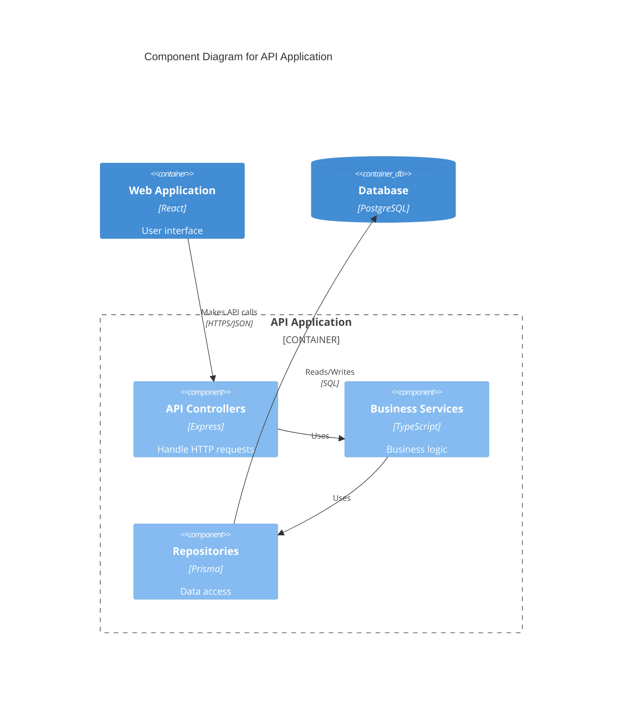

# Level 3: Component Diagram

The Component diagram zooms into an individual container and shows the components inside it.

## Purpose

- Shows the major structural building blocks (components) within a container
- Shows the responsibilities of each component
- Shows the relationships and dependencies between components
- Helps understand the internal structure of complex containers

## What is a "Component"?

In the C4 model, a **component** is a grouping of related functionality behind a well-defined interface. Examples include:

- **Services/Managers** - Business logic components
- **Controllers/Handlers** - Request handling components
- **Repositories** - Data access components
- **Utilities/Helpers** - Cross-cutting concerns
- **Adapters** - Integration with external systems
- **Event Handlers** - Asynchronous processing components

Components should map to real code structures:
- Classes or groups of classes
- Modules or packages
- Microservices' internal structure

## Key Elements

- **Components** - Major code structures within a container
- **Interfaces** - Well-defined APIs between components
- **Relationships** - How components depend on each other
- **External dependencies** - Other containers or systems

## Guidelines

1. **Not for every container** - Only create component diagrams for complex containers
2. **Focus on the big picture** - Show major components, not every class
3. **Show responsibilities** - Make it clear what each component does
4. **Show dependencies** - Highlight key relationships
5. **Multiple diagrams** - One per container that needs this level of detail
6. **Keep it updated** - As the architecture evolves

## Example: Component Diagram (API Application)

```plantuml
@startuml
!include https://raw.githubusercontent.com/plantuml-stdlib/C4-PlantUML/master/C4_Component.puml

LAYOUT_WITH_LEGEND()

title Component Diagram for API Application

Container(webApp, "Web Application", "React", "User interface")

Container_Boundary(api, "API Application") {
    Component(authController, "Auth Controller", "Express Controller", "Handles authentication requests")
    Component(userController, "User Controller", "Express Controller", "Handles user management")
    Component(authService, "Auth Service", "Service", "Implements authentication logic")
    Component(userService, "User Service", "Service", "Implements user business logic")
    Component(userRepo, "User Repository", "Repository", "Provides data access for users")
    Component(emailAdapter, "Email Adapter", "Adapter", "Sends emails via external service")
}

ContainerDb(database, "Database", "PostgreSQL", "Stores user data")
System_Ext(emailSystem, "Email System", "External email service")

Rel(webApp, authController, "Makes API calls", "HTTPS/JSON")
Rel(webApp, userController, "Makes API calls", "HTTPS/JSON")

Rel(authController, authService, "Uses")
Rel(userController, userService, "Uses")

Rel(authService, userRepo, "Uses")
Rel(userService, userRepo, "Uses")
Rel(userService, emailAdapter, "Uses")

Rel(userRepo, database, "Reads/Writes", "SQL")
Rel(emailAdapter, emailSystem, "Sends emails", "SMTP")

@enduml
```

## Mermaid Alternative



## Template

Use this template to document components:

### Component: [Component Name]

**Type:** [Controller | Service | Repository | Adapter | Handler | etc.]  
**Location:** [Package/module path in code]  
**Language/Framework:** [Primary technology]

**Responsibilities:**
- [Primary responsibility 1]
- [Primary responsibility 2]

**Exposed Interface:**
```typescript
// Example interface or key methods
interface ComponentName {
  method1(param: Type): ReturnType;
  method2(param: Type): ReturnType;
}
```

**Dependencies:**
- [Component/Container it depends on]
- [Why it depends on it]

**Used By:**
- [Components that use this component]

## Architectural Patterns

Document any patterns used within the container:

- **Layered Architecture** - Controller → Service → Repository
- **Hexagonal Architecture** - Ports and Adapters
- **CQRS** - Command/Query Separation
- **Event-Driven** - Event handlers and publishers
- **Dependency Injection** - How dependencies are managed

## Tips

- Only create component diagrams for containers with significant complexity
- Keep the number of components manageable (5-15 is ideal)
- Group fine-grained components into coarser-grained ones if needed
- Update when major refactoring occurs
- Link to actual code files or packages in documentation
- Consider generating these diagrams from code using tools
