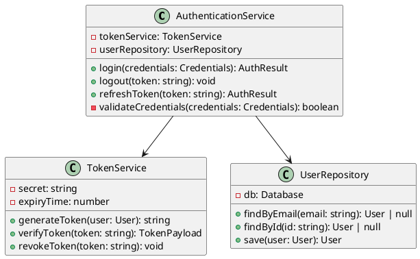
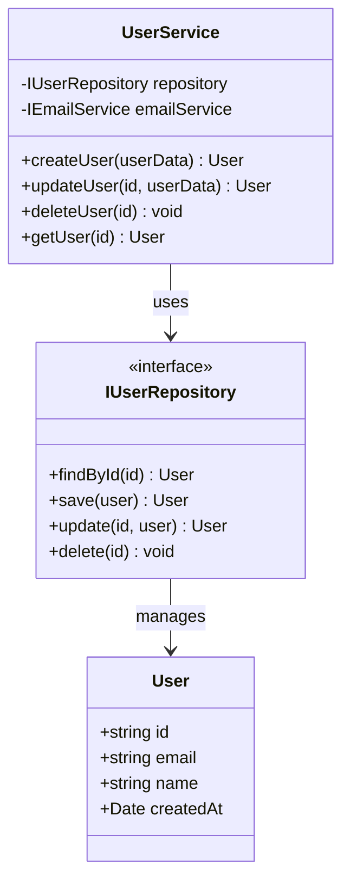

# Level 4: Code Diagram

The Code diagram (also called Class diagram) is the most detailed level and shows how a component is implemented using classes, interfaces, and other code structures.

## Purpose

- Shows the lowest level of detail in the C4 model
- Useful for documenting complex algorithms or critical code paths
- Can be generated automatically from code using tools
- Helps with detailed design discussions

## What is "Code Level"?

At this level, you're showing:
- **Classes** and their relationships
- **Interfaces** and implementations
- **Methods** and their signatures
- **Design patterns** in use
- **Inheritance hierarchies**
- **Associations** between classes

## Important Notes

⚠️ **Level 4 is optional** - Most teams don't need this level of detail as:
- IDEs and code editors can show this information
- Code is the source of truth
- Diagrams at this level quickly become outdated
- Better to generate these from code if needed

## When to Use Code Diagrams

Consider creating code-level diagrams when:
- Documenting **complex algorithms** that need visual explanation
- Showing **critical design patterns** used in the codebase
- Onboarding new team members to **complex code areas**
- Discussing **proposed refactoring** or design changes
- Meeting **regulatory requirements** for detailed documentation

## Recommended Approach

Instead of manually creating code diagrams, consider:

1. **IDE Tools** - Most IDEs can generate class diagrams from code
2. **Documentation from Code** - Use tools like TypeDoc, JSDoc, Doxygen
3. **UML Generation** - Tools like PlantUML can generate diagrams from code
4. **Just Use the Code** - The code itself is often the best documentation

## Example: Code-Level Diagram

```plantuml
@startuml
!include https://raw.githubusercontent.com/plantuml-stdlib/C4-PlantUML/master/C4_Component.puml

title Class Diagram for User Service Component

package "User Service" {
    interface IUserService {
        +createUser(userData: CreateUserDTO): Promise<User>
        +updateUser(id: string, userData: UpdateUserDTO): Promise<User>
        +deleteUser(id: string): Promise<void>
        +getUser(id: string): Promise<User>
        +listUsers(criteria: UserSearchCriteria): Promise<User[]>
    }
    
    class UserService implements IUserService {
        -repository: IUserRepository
        -emailService: IEmailService
        -validator: IValidator
        +constructor(repository, emailService, validator)
        +createUser(userData: CreateUserDTO): Promise<User>
        +updateUser(id: string, userData: UpdateUserDTO): Promise<User>
        +deleteUser(id: string): Promise<void>
        +getUser(id: string): Promise<User>
        +listUsers(criteria: UserSearchCriteria): Promise<User[]>
        -validateUserData(userData: any): ValidationResult
        -sendWelcomeEmail(user: User): Promise<void>
    }
    
    interface IUserRepository {
        +findById(id: string): Promise<User | null>
        +findAll(criteria: FilterCriteria): Promise<User[]>
        +save(user: User): Promise<User>
        +update(id: string, user: Partial<User>): Promise<User>
        +delete(id: string): Promise<void>
    }
    
    class UserRepository implements IUserRepository {
        -db: Database
        +constructor(db)
        +findById(id: string): Promise<User | null>
        +findAll(criteria: FilterCriteria): Promise<User[]>
        +save(user: User): Promise<User>
        +update(id: string, user: Partial<User>): Promise<User>
        +delete(id: string): Promise<void>
    }
    
    class User {
        +id: string
        +email: string
        +name: string
        +createdAt: Date
        +updatedAt: Date
        +isActive: boolean
    }
    
    class CreateUserDTO {
        +email: string
        +name: string
        +password: string
    }
    
    class UpdateUserDTO {
        +email?: string
        +name?: string
        +isActive?: boolean
    }
}

UserService --> IUserRepository : uses
UserService --> IEmailService : uses
UserService --> IValidator : uses
UserRepository --> User : manages
UserService --> User : creates/modifies
UserService --> CreateUserDTO : accepts
UserService --> UpdateUserDTO : accepts

@enduml
```

## UML Class Diagram Example



## Alternative: Mermaid Class Diagram



## Tools for Generating Code Diagrams

### From TypeScript/JavaScript
- **TypeDoc** - Generate documentation with diagrams
- **tsdoc** - TypeScript documentation generator
- **Compodoc** (Angular) - Documentation tool with diagrams

### From Code to UML
- **PlantUML** - Can parse code in some languages
- **ts-uml** - TypeScript to PlantUML
- **tplant** - TypeScript to PlantUML

### IDE Plugins
- **Visual Studio Code** - PlantUML extensions
- **IntelliJ IDEA** - Built-in UML diagram generation
- **WebStorm** - Built-in diagram support

### Online Tools
- **Mermaid Live Editor** - For Mermaid diagrams
- **PlantText** - For PlantUML diagrams
- **draw.io** - Manual diagram creation

## Best Practices

1. **Generate, don't draw** - Use tools to generate from code
2. **Focus on critical areas** - Only document complex or important code
3. **Keep it updated** - If you can't keep it updated, don't create it
4. **Link to code** - Always link diagrams to actual source code
5. **Use IDEs** - Most IDEs can show this level of detail on demand
6. **Consider alternatives** - Well-written code and tests often suffice

## When NOT to Create Code Diagrams

❌ Don't create code-level diagrams if:
- The code is simple and self-explanatory
- You can't commit to keeping them updated
- IDEs already provide this visualization
- The team prefers reading code directly
- Documentation exists in the code itself (comments, types)

## Tips

- Use Level 4 sparingly - it's the most detailed and hardest to maintain
- Prefer generated diagrams over manually created ones
- Focus on showing design patterns and relationships, not every method
- Consider using sequence diagrams for complex interactions instead
- Link to actual code files for the source of truth
- Update only when significant refactoring occurs
