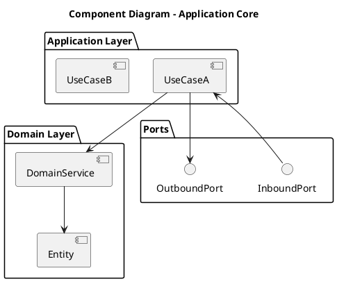

# Architecture – 4C Model (Hexagonal)

## C3 – Component View

> **Purpose**
> This document describes the **internal component structure** of the system, with a strong focus on the **Application Core** as defined by **Hexagonal Architecture (Ports & Adapters)**.
>
> This view explains **how responsibilities are split**, **how dependencies are oriented**, and **how business rules are protected**.

---

## 1. Scope of the Component View

This view applies to:

* The **Application Core container**
* Its internal layers (Application, Domain)
* The definition of **ports** used by adapters

This view deliberately **excludes infrastructure implementations**.

---

## 2. Hexagonal Layers Inside the Core

The Application Core is structured into the following layers:

| Layer       | Responsibility             | Allowed Dependencies |
| ----------- | -------------------------- | -------------------- |
| Application | Use cases, orchestration   | Domain only          |
| Domain      | Business rules, invariants | None                 |
| Ports       | Interfaces (contracts)     | Domain / Application |

---

## 3. Component Types

### 3.1 Application Components

| Component Type      | Description                                   |
| ------------------- | --------------------------------------------- |
| Use Case            | Coordinates a business interaction end-to-end |
| Application Service | Groups related use cases                      |
| Command / Query     | Immutable input to a use case                 |

Rules:

* Stateless
* One use case = one business intent

---

### 3.2 Domain Components

| Component Type | Description                           |
| -------------- | ------------------------------------- |
| Entity         | Holds identity and invariants         |
| Value Object   | Immutable domain value                |
| Domain Service | Business logic not owned by an entity |
| Domain Event   | Significant business fact             |

Rules:

* No IO
* No framework annotations
* Fully deterministic

---

### 3.3 Port Components

| Port Type     | Direction | Description                  |
| ------------- | --------- | ---------------------------- |
| Inbound Port  | Driving   | Entry point for use cases    |
| Outbound Port | Driven    | Required external capability |

Rules:

* Defined in the core
* Implemented by adapters

---

## 4. Selected Container

**Container:** Application Core
**Responsibility:** Execute business use cases while remaining independent of infrastructure.

---

## 5. Component Inventory (Core)

| Component         | Layer       | Responsibility                 |
| ----------------- | ----------- | ------------------------------ |
| `<UseCaseX>`      | Application | Execute business workflow X    |
| `<UseCaseY>`      | Application | Execute business workflow Y    |
| `<DomainEntity>`  | Domain      | Enforce invariant Z            |
| `<DomainService>` | Domain      | Complex business rule          |
| `<InboundPort>`   | Port        | Entry point for UseCaseX       |
| `<OutboundPort>`  | Port        | Persistence / external service |

---

## 6. Dependency Rules (Strict)

The following rules are **mandatory and enforceable**:

1. Domain depends on nothing
2. Application depends only on Domain
3. Ports depend on Domain/Application, never infrastructure
4. No component may depend on an adapter implementation
5. Dependency direction must always point **inward**

---

## 7. Component Diagram (PlantUML)

---

## 8. Error Handling Strategy

| Layer       | Strategy                               |
| ----------- | -------------------------------------- |
| Domain      | Domain-specific errors / invariants    |
| Application | Error mapping, orchestration decisions |
| Adapters    | Translation to technical errors        |

Rules:

* No technical exception in Domain
* Errors cross ports as typed results

---

## 9. Validation & Contracts

* Input validation at **inbound adapters**
* Business validation in **domain entities/services**
* Port contracts enforced at compile time

---

## 10. Testability Guarantees

| Component | Test Type             |
| --------- | --------------------- |
| Use Case  | Unit / Contract tests |
| Domain    | Pure unit tests       |
| Ports     | Mocked interfaces     |

---
