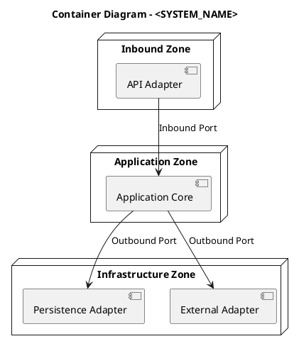

# Architecture – 4C Model (Hexagonal)

## C2 – Container View

> **Purpose**
> This document describes the **Container View** of the system following **Hexagonal Architecture** principles.
> It decomposes the system into **deployable/runtime units** and shows how each container maps to **ports and adapters**.

---

## 1. Container View Scope

This view answers the following questions:

* What executable units compose the system?
* Where does the hexagonal core live at runtime?
* How do containers communicate with each other?
* Which technologies are used, and where?

This view is **technology-aware** but must **not leak infrastructure concerns into the domain**.

---

## 2. Architectural Mapping (Hexagonal → Containers)

| Hexagonal Concept | Runtime Representation             |
| ----------------- | ---------------------------------- |
| Application Core  | Application Service Container      |
| Inbound Ports     | API                                |
| Outbound Ports    | Interfaces implemented by adapters |
| Adapters          | Infrastructure Containers          |

---

## 3. Container Inventory

Each container is a **deployable and independently executable unit**.

| Container              | Type             | Technology        | Responsibility                | Criticality |
| ---------------------- | ---------------- | ----------------- | ----------------------------- | ----------- |
| `<API_CONTAINER>`      | Inbound Adapter  | REST / gRPC / ROS | Entry point, validation, auth | High        |
| `<APP_CORE_CONTAINER>` | Application Core | `<LANGUAGE>`      | Use cases & orchestration     | Critical    |
| `<WORKER_CONTAINER>`   | Outbound Adapter | Async / Jobs      | External side effects         | Medium      |
| `<DB_CONTAINER>`       | Data Store       | SQL / NoSQL       | Persistence                   | High        |
| `<OBS_CONTAINER>`      | Support          | Metrics / Logs    | Observability                 | Medium      |

---

## 4. Container Responsibilities

### 4.1 Inbound Adapter Containers

Responsibilities:

* Translate external requests into **application commands**
* Perform authentication and authorization
* Enforce input contracts (DTO validation)

Constraints:

* No business logic
* No direct access to infrastructure resources

---

### 4.2 Application Core Container

Responsibilities:

* Execute **use cases**
* Enforce business invariants
* Coordinate outbound ports

Constraints:

* No framework dependencies
* No network or filesystem access
* Pure orchestration and domain logic

---

### 4.3 Outbound Adapter Containers

Responsibilities:

* Implement outbound ports
* Handle IO, persistence, messaging

Constraints:

* Must conform strictly to port contracts
* Must not leak technical errors into the core

---

## 5. Inter-Container Communication

### 5.1 Communication Matrix

| From             | To               | Protocol         | Sync         | Data                |
| ---------------- | ---------------- | ---------------- | ------------ | ------------------- |
| Inbound Adapter  | Application Core | In-process / IPC | Sync         | Command DTO         |
| Application Core | Outbound Adapter | Interface call   | Sync / Async | Domain Event        |
| Outbound Adapter | External System  | HTTP / Bus       | Async        | Integration Payload |

---

### 5.2 Communication Rules

* No inbound calls into adapters
* Core never initiates network calls directly
* All external communication goes through adapters

---

## 6. Container Diagram (PlantUML)

---

## 7. Deployment Considerations

### 7.1 Deployment Model

* Deployment style: `<MONOLITH / MODULAR MONOLITH / MICRO-CONTAINERS>`
* Container isolation: `<PROCESS / VM / POD>`
* Configuration injection: `<ENV / FILE / SERVICE>`

---

### 7.2 Scalability & Resilience

| Aspect  | Strategy                 |
| ------- | ------------------------ |
| Scaling | `<NONE / HORIZONTAL>`    |
| Failure | `<FAIL-FAST / DEGRADED>` |
| Retry   | `<ADAPTER-ONLY>`         |
| Timeout | `<EDGE-ENFORCED>`        |

---

## 8. Security Boundaries

| Boundary                   | Enforcement           |
| -------------------------- | --------------------- |
| External → Inbound Adapter | AuthN / AuthZ         |
| Adapter → Core             | Contract validation   |
| Core → Adapter             | Interface enforcement |

---
