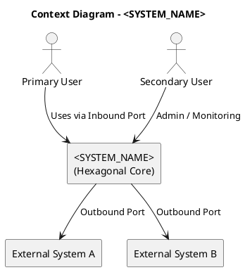

# Architecture – 4C Model (Hexagonal)

## C1 – Context View

> **Purpose**
> This document describes the **system context** for a system designed following **Hexagonal Architecture (Ports & Adapters)** principles.
> It defines **what the system is**, **who interacts with it**, and **what is explicitly outside its responsibility**.

---

## 1. System Overview

### 1.1 System Name

`<SYSTEM_NAME>`

### 1.2 System Intent

Describe in **one or two sentences** the core business value of the system.

---

## 2. Business Responsibilities

### 2.1 In-Scope Responsibilities

The system **is responsible for**:

* `<BUSINESS_CAPABILITY_1>`
* `<BUSINESS_CAPABILITY_2>`
* `<BUSINESS_CAPABILITY_3>`

Each responsibility must:

* Be technology-agnostic
* Represent a business or mission concern
* Be stable over time

---

### 2.2 Explicitly Out of Scope

The system **does NOT**:

* `<OUT_OF_SCOPE_ITEM_1>`
* `<OUT_OF_SCOPE_ITEM_2>`

> Rationale: explicitly defining exclusions prevents architectural erosion and scope creep.

---

## 3. Actors

Actors are **external to the hexagon** and interact only through **ports**.

| Actor          | Type           | Description          | Criticality         |
| -------------- | -------------- | -------------------- | ------------------- |
| `<ACTOR_NAME>` | Human / System | `<ROLE_DESCRIPTION>` | Low / Medium / High |

---

## 4. External Systems

External systems are **not controlled** by this system and must be accessed via **adapters**.

| System       | Interaction         | Direction          | Notes                  |
| ------------ | ------------------- | ------------------ | ---------------------- |
| `<SYSTEM_A>` | API / Events / Data | Inbound / Outbound | `<CONSTRAINTS>`        |
| `<SYSTEM_B>` | Protocol / Bus      | Inbound / Outbound | `<LATENCY / SECURITY>` |

---

## 5. Context Boundaries

### 5.1 Trust Boundaries

| Boundary          | Description                               |
| ----------------- | ----------------------------------------- |
| External → System | Authentication, validation, rate limiting |
| Adapter → Core    | Input sanitization, contract enforcement  |

---

### 5.2 Hexagonal Positioning

* The **System Core** contains business rules and use cases
* All actors and systems are **outside** the hexagon
* No external element has direct access to domain logic

---

## 6. Context Diagram (PlantUML)

---

## 7. High-Level Constraints

### 7.1 Architectural Constraints

* Architecture style: **Hexagonal (Ports & Adapters)**
* Business logic isolated from frameworks
* All IO must cross a port

### 7.2 Non-Functional Constraints

| Category     | Constraint                                 |
| ------------ | ------------------------------------------ |
| Security     | `<AUTH / CRYPTO / ISOLATION>`              |
| Availability | `<UPTIME / DEGRADED MODE>`                 |
| Latency      | `<REALTIME / NEAR-REALTIME / BEST-EFFORT>` |
| Compliance   | `<STANDARD / NONE>`                        |

---

## 8. Key Risks at Context Level

* `<INTEGRATION_RISK>`
* `<ACTOR_MISUSE_RISK>`
* `<DEPENDENCY_RISK>`

---
