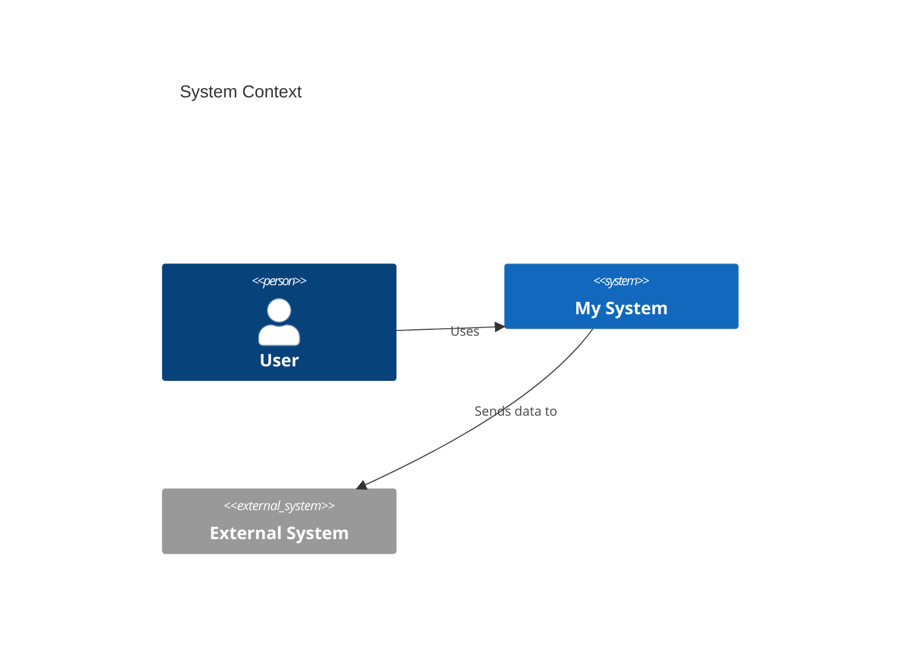

# Diagram Tools and Guidelines

This directory contains information about tools and approaches for creating C4 architecture diagrams.

## Recommended Diagramming Tools

### 1. PlantUML with C4-PlantUML

**Best for:** Teams comfortable with text-based diagrams, version control integration

**Pros:**
- ✅ Text-based, easy to version control and review in PRs
- ✅ C4-PlantUML library provides ready-made C4 components
- ✅ Can be integrated into CI/CD pipelines
- ✅ Works offline
- ✅ Free and open source

**Cons:**
- ❌ Steeper learning curve
- ❌ Limited control over layout
- ❌ Requires Java runtime

**Setup:**
```bash
# Install PlantUML (requires Java)
brew install plantuml

# Or use Docker
docker run -d -p 8080:8080 plantuml/plantuml-server:jetty
```

**Example:**
```plantuml
@startuml
!include https://raw.githubusercontent.com/plantuml-stdlib/C4-PlantUML/master/C4_Context.puml

Person(user, "User")
System(system, "My System")
System_Ext(external, "External System")

Rel(user, system, "Uses")
Rel(system, external, "Sends data to")
@enduml
```

**Resources:**
- [PlantUML Official Site](https://plantuml.com/)
- [C4-PlantUML GitHub](https://github.com/plantuml-stdlib/C4-PlantUML)
- [VS Code PlantUML Extension](https://marketplace.visualstudio.com/items?itemName=jebbs.plantuml)

---

### 2. Structurizr

**Best for:** Teams wanting a dedicated C4 modeling tool with DSL and UI options

**Pros:**
- ✅ Built specifically for C4 model
- ✅ DSL is clean and readable
- ✅ Multiple diagram views from single model
- ✅ Web-based UI available (Structurizr Lite)
- ✅ Automatic layout

**Cons:**
- ❌ Commercial product (free tier available)
- ❌ Requires learning Structurizr DSL
- ❌ Less flexible for custom styling

**Example (Structurizr DSL):**
```
workspace {
    model {
        user = person "User"
        system = softwareSystem "My System"
        external = softwareSystem "External System"
        
        user -> system "Uses"
        system -> external "Sends data to"
    }
    
    views {
        systemContext system {
            include *
            autolayout lr
        }
    }
}
```

**Resources:**
- [Structurizr Official Site](https://structurizr.com/)
- [Structurizr DSL](https://github.com/structurizr/dsl)
- [Structurizr Lite](https://structurizr.com/help/lite)

---

### 3. Mermaid

**Best for:** Teams using GitHub/GitLab, simple diagrams, markdown integration

**Pros:**
- ✅ Native support in GitHub, GitLab, and many markdown tools
- ✅ Simple syntax
- ✅ No installation required
- ✅ Live preview in many editors
- ✅ Free and open source

**Cons:**
- ❌ Less mature C4 support than PlantUML
- ❌ Fewer styling options
- ❌ Layout can be unpredictable

**Example:**


**Resources:**
- [Mermaid Official Site](https://mermaid.js.org/)
- [Mermaid Live Editor](https://mermaid.live/)
- [C4 Diagram Syntax](https://mermaid.js.org/syntax/c4.html)

---

### 4. draw.io / diagrams.net

**Best for:** Teams preferring visual editors, one-off diagrams

**Pros:**
- ✅ User-friendly visual interface
- ✅ Works offline (desktop app available)
- ✅ Free and open source
- ✅ Many shape libraries available
- ✅ Can export to various formats

**Cons:**
- ❌ Not text-based (harder to review in PRs)
- ❌ Manual layout and updates
- ❌ Requires more effort to keep consistent

**Resources:**
- [diagrams.net](https://www.diagrams.net/)
- [C4 Model Shapes for draw.io](https://github.com/tobiashochguertel/c4-draw.io)

---

### 5. Excalidraw

**Best for:** Teams wanting sketch-style diagrams, collaborative whiteboarding

**Pros:**
- ✅ Beautiful hand-drawn style
- ✅ Real-time collaboration
- ✅ Very intuitive UI
- ✅ Free and open source
- ✅ Can export as SVG/PNG

**Cons:**
- ❌ Not text-based
- ❌ No specific C4 library
- ❌ More suited for sketching than formal diagrams

**Resources:**
- [Excalidraw](https://excalidraw.com/)
- [Excalidraw VS Code Extension](https://marketplace.visualstudio.com/items?itemName=pomdtr.excalidraw-editor)

---

## Tool Comparison Matrix

| Tool | Text-Based | Version Control | Auto-Layout | C4 Support | Learning Curve | Collaboration |
|------|-----------|----------------|-------------|------------|---------------|---------------|
| PlantUML + C4 | ✅ | ✅ | ✅ | ✅✅✅ | Medium | Via PR |
| Structurizr | ✅ | ✅ | ✅✅ | ✅✅✅ | Medium | Via DSL |
| Mermaid | ✅ | ✅ | ✅ | ✅✅ | Easy | Via PR |
| draw.io | ❌ | ⚠️ | ❌ | ⚠️ | Easy | Via file |
| Excalidraw | ❌ | ⚠️ | ❌ | ❌ | Very Easy | ✅✅ |

## Our Recommendation

For this repository, we recommend:

**Primary:** PlantUML with C4-PlantUML
- Best balance of power, version control, and C4 support
- Text-based for easy PR reviews
- Can be automated in CI/CD

**Secondary:** Mermaid for simple diagrams
- When diagrams need to be embedded in GitHub/GitLab
- For quick sketches and simple relationships

**For Sketching:** Excalidraw
- Initial design discussions
- Collaborative whiteboarding sessions
- Can be converted to formal diagrams later

## Diagram File Organization

```
docs/architecture/diagrams/
├── README.md                    # This file
├── examples/                    # Example diagrams
│   ├── example-context.puml
│   ├── example-container.puml
│   └── example-component.puml
└── src/                        # Source files for actual diagrams
    ├── context/
    ├── container/
    ├── component/
    └── code/
```

## Workflow

### Creating New Diagrams

1. **Choose the right tool** based on the use case
2. **Create the diagram source** in the appropriate format
3. **Generate the image** (if applicable)
4. **Embed in documentation** via markdown
5. **Commit both source and generated image** to git

### Updating Diagrams

1. **Edit the source file** (not the generated image)
2. **Regenerate the image**
3. **Update the documentation** if needed
4. **Commit changes** with descriptive message

### Reviewing Diagrams

For text-based diagrams (PlantUML, Mermaid, Structurizr):
- Review the source in the PR
- Check the rendered output in documentation
- Verify consistency with other diagrams

For visual diagrams (draw.io, Excalidraw):
- Export as SVG for better diff viewing
- Include before/after screenshots in PR description
- Review for consistency with style guide

## CI/CD Integration

You can automatically generate diagrams in CI/CD:

```yaml
# Example GitHub Actions workflow
name: Generate Diagrams

on: [push, pull_request]

jobs:
  generate:
    runs-on: ubuntu-latest
    steps:
      - uses: actions/checkout@v2
      
      - name: Generate PlantUML diagrams
        uses: cloudbees/plantuml-github-action@master
        with:
          args: -v -tsvg docs/architecture/**/*.puml
      
      - name: Commit generated diagrams
        run: |
          git config --local user.email "action@github.com"
          git config --local user.name "GitHub Action"
          git add docs/architecture/**/*.svg
          git commit -m "Generate diagrams" || echo "No changes"
          git push
```

## Style Guide

### Colors
Use the standard C4 color scheme:
- **Person:** #08427B (Dark Blue)
- **Internal System/Container:** #1168BD (Blue)
- **External System:** #999999 (Gray)
- **Database:** #438DD5 (Light Blue)

### Text
- Use clear, concise labels
- Avoid jargon unless necessary
- Be consistent with naming across diagrams

### Layout
- Keep diagrams simple and uncluttered
- Group related elements together
- Use consistent spacing
- Add legends when helpful

## Tips

1. **Start simple** - Don't add everything to the first version
2. **Iterate** - Diagrams evolve with the system
3. **Get feedback** - Share early and often with the team
4. **Automate** - Use tools to generate diagrams from code when possible
5. **Keep it DRY** - Define common elements once
6. **Version control** - Always commit diagram sources
7. **Document decisions** - Link diagrams to ADRs
